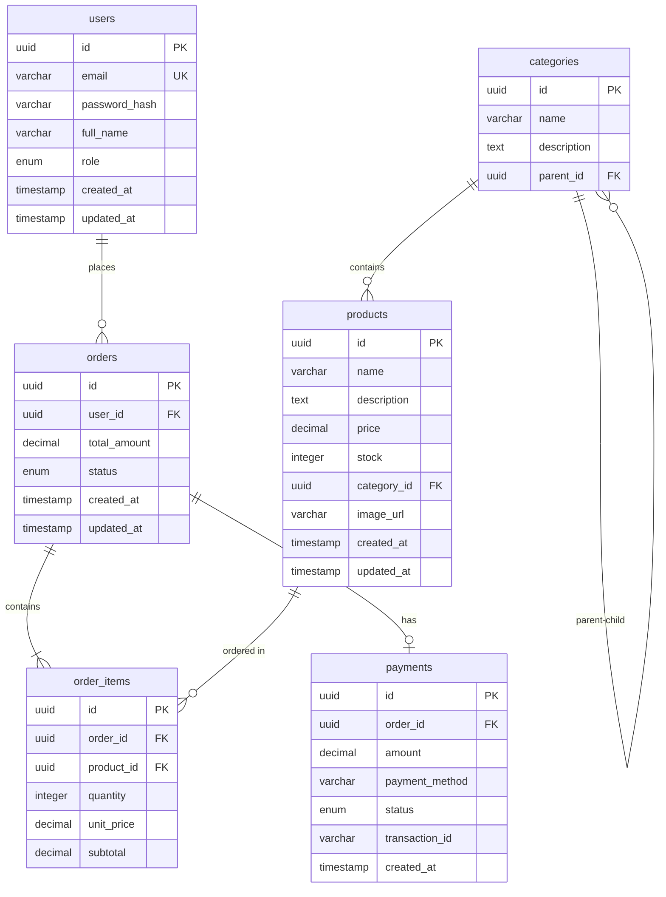

# Decisión: Diseño de Base de Datos

## Contexto

El Dashboard de Ventas requiere almacenar y consultar eficientemente:
- Datos de usuarios del sistema (autenticación y roles)
- Información de productos (catálogo)
- Transacciones de ventas (órdenes, detalles, pagos)
- Métricas agregadas para reportes (ventas por período, categorías)
- Configuraciones del sistema

Se necesita una base de datos que soporte:
- Relaciones complejas entre entidades
- Consultas analíticas (agrupaciones, sumatorias)
- Integridad referencial
- Rendimiento aceptable para consultas de reportes

---

## Opciones Evaluadas

### Opción 1: PostgreSQL

**Pros:**
- Base de datos relacional madura y robusta
- Soporte completo para ACID
- Funciones avanzadas (CTEs, ventanas, JSON)
- Excelente rendimiento en consultas analíticas
- Soporte geográfico y de tipos personalizados
- Open source con licencia permisiva

**Contras:**
- Configuración más compleja que MySQL
- Consumo de recursos mayor para proyectos pequeños
- Curva de aprendizaje para funcionalidades avanzadas

### Opción 2: MySQL

**Pros:**
- Fácil de configurar y usar
- Amplio soporte en plataformas de hosting
- Buen rendimiento para operaciones CRUD simples
- Gran cantidad de tutoriales y recursos disponibles

**Contras:**
- Menor soporte para consultas analíticas complejas
- Limitaciones en funcionalidades avanzadas (CTEs en versiones anteriores)
- Licencia dual (GPL/comercial)

### Opción 3: MongoDB

**Pros:**
- Modelo de documentos flexible (schema-less)
- Excelente para datos semiestructurados
- Escalado horizontal nativo
- Ideal para prototipado rápido

**Contras:**
- Menor consistencia para relaciones complejas
- No soporta transacciones ACID completas (hasta versiones recientes)
- Consultas analíticas menos eficientes que SQL
- Consistencia eventual en configuraciones distribuidas

---

## Decisión Tomada

**Opción seleccionada: PostgreSQL**

### Justificación

1. **Naturaleza relacional de los datos:** Los datos de ventas, productos y usuarios tienen relaciones claras que se modelan mejor con un esquema relacional.

2. **Requisitos analíticos:** Las consultas de reportes (ventas por categoría, totales por período, comparativas) son más eficientes con SQL y funciones de ventana que con agregaciones en MongoDB.

3. **Integridad referencial:** La consistencia de datos es crítica en un sistema de ventas. Las foreign keys y constraints de PostgreSQL garantizan integridad a nivel de base de datos.

4. **Alineación con Spring Boot:** La integración con Spring Data JPA y Hibernate es más robusta y madura para bases de datos relacionales.

5. **Escalabilidad futura:** PostgreSQL soporta desde proyectos pequeños hasta aplicaciones empresariales de alto volumen.

---

## Modelo de Datos Propuesto

### Entidades Principales

```
┌─────────────────┐     ┌─────────────────┐     ┌─────────────────┐
│     users       │     │    products     │     │    categories   │
├─────────────────┤     ├─────────────────┤     ├─────────────────┤
│ id (PK)         │     │ id (PK)         │     │ id (PK)         │
│ email           │     │ name            │     │ name            │
│ password_hash   │     │ description     │     │ description     │
│ full_name       │     │ price           │     │ parent_id (FK)  │
│ role            │     │ stock           │     └─────────────────┘
│ created_at      │     │ category_id (FK)│
│ updated_at      │     │ image_url       │
└─────────────────┘     │ created_at      │
                        │ updated_at      │
                        └─────────────────┘
                                │
                                ▼
┌─────────────────┐     ┌─────────────────┐     ┌─────────────────┐
│    orders       │     │  order_items    │     │    payments     │
├─────────────────┤     ├─────────────────┤     ├─────────────────┤
│ id (PK)         │     │ id (PK)         │     │ id (PK)         │
│ user_id (FK)    │     │ order_id (FK)   │     │ order_id (FK)   │
│ total_amount    │     │ product_id (FK) │     │ amount          │
│ status          │     │ quantity        │     │ payment_method  │
│ created_at      │     │ unit_price      │     │ status          │
│ updated_at      │     │ subtotal        │     │ transaction_id  │
└─────────────────┘     └─────────────────┘     │ created_at      │
                                                └─────────────────┘
```

### Diagrama ER (Mermaid)



---

## Decisiones de Implementación

### 1. Tipos de Datos

| Campo | Tipo PostgreSQL | Justificación |
|:------|:----------------|:--------------|
| IDs | UUID | Seguridad y distribución |
| Precios | DECIMAL(10,2) | Precisión monetaria |
| Estados | ENUM | Integridad de valores |
| Fechas | TIMESTAMP WITH TIME ZONE | Soporte horario global |
| Texto largo | TEXT | Flexibilidad |

### 2. Índices Propuestos

```sql
-- Índices para consultas frecuentes
CREATE INDEX idx_users_email ON users(email);
CREATE INDEX idx_products_category ON products(category_id);
CREATE INDEX idx_orders_user ON orders(user_id);
CREATE INDEX idx_orders_status ON orders(status);
CREATE INDEX idx_orders_created ON orders(created_at);
CREATE INDEX idx_order_items_order ON order_items(order_id);
CREATE INDEX idx_payments_order ON payments(order_id);
```

### 3. Estrategia de Migración

- Usar **Flyway** para gestión de migraciones de esquema
- Migraciones versionadas y numeradas
- Script de seed para datos iniciales de prueba

---

## Consecuencias

### Positivas
- Modelo de datos claro y documentado
- Integridad referencial garantizada
- Consultas analíticas eficientes con SQL
- Soporte para funciones de ventana (ranking de ventas, etc.)

### Negativas
- Mayor complejidad de configuración que MongoDB
- Necesidad de diseñar esquema explícitamente
- Menor flexibilidad para cambios de esquema frecuentes

### Riesgos
- Rendimiento en tablas muy grandes (mitigado con índices y particionamiento)
- Complejidad de migraciones en producción (mitigado con Flyway)

---

## Referencias

- [PostgreSQL Official Documentation](https://www.postgresql.org/docs/)
- [Spring Data JPA - PostgreSQL](https://spring.io/guides/gs/accessing-data-jpa/)
- [Flyway Database Migration](https://flywaydb.org/)

---

**Fecha de decisión:** *[Completar]*
**Tomada por:** *[Nombre del desarrollador]*
**Revisada por:** *[Si aplica]*
